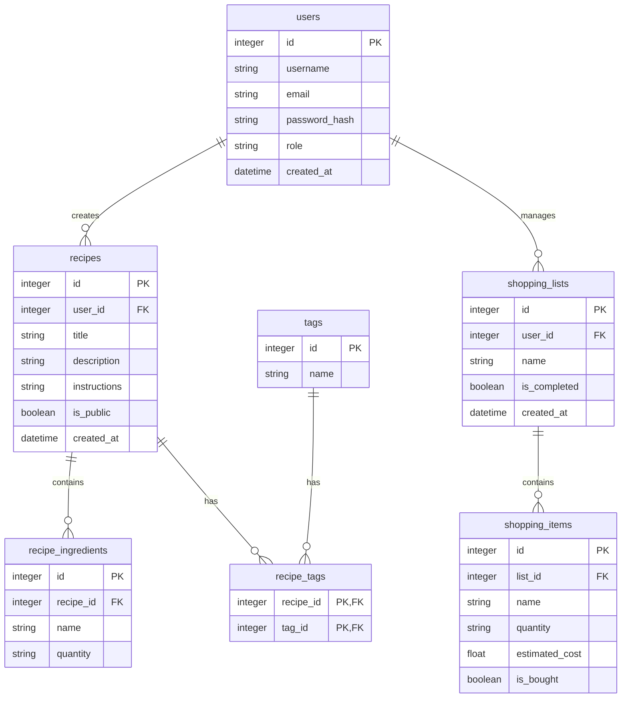

# 資料庫設計文件 (DB Design) - 食譜收藏夾系統

本文件詳細記錄了系統所需之資料庫架構設計，包含資料表結構、關聯與欄位定義。

## 1. ER 圖 (實體關係圖)

## 2. 資料表詳細說明

### users (使用者表)
儲存系統使用者的基本資訊與認證資料。
- `id` (INTEGER): Primary Key，自動遞增。
- `username` (VARCHAR): 使用者名稱，必填且唯一。
- `email` (VARCHAR): 電子郵件信箱，必填且唯一。
- `password_hash` (VARCHAR): 經過雜湊處理的密碼，必填。
- `role` (VARCHAR): 使用者角色，例如 'user' 或 'admin'。
- `created_at` (DATETIME): 帳號建立時間。

### recipes (食譜表)
儲存食譜與作法等主要資訊。
- `id` (INTEGER): Primary Key。
- `user_id` (INTEGER): Foreign Key 關聯至 `users.id`，標記食譜作者。
- `title` (VARCHAR): 食譜標題。
- `description` (TEXT): 描述或簡介。
- `instructions` (TEXT): 烹調步驟（可儲存為換行符號隔開的連續文字或 JSON 格式）。
- `is_public` (BOOLEAN): 是否為公開。供公版懶人食譜使用。
- `created_at` (DATETIME): 建立時間。

### recipe_ingredients (食譜食材表)
紀錄某個食譜所需的所有食材與份量。
- `id` (INTEGER): Primary Key。
- `recipe_id` (INTEGER): Foreign Key 關聯至 `recipes.id`。
- `name` (VARCHAR): 食材名稱（如：高麗菜）。
- `quantity` (VARCHAR): 份量大小（如：半顆、100g）。

### tags (標籤表)
支援彈性的分類系統，特別是「懶人專用」、「微波爐」等分類。
- `id` (INTEGER): Primary Key。
- `name` (VARCHAR): 標籤名稱，必填且唯一。

### recipe_tags (食譜與標籤關聯表)
由於多個食譜可擁有多個標籤，此為多對多之儲存表。
- `recipe_id` (INTEGER): Foreign Key。
- `tag_id` (INTEGER): Foreign Key。

### shopping_lists (購物清單表)
用戶欲採買的購物清單（可由食譜直接轉換）。
- `id` (INTEGER): Primary Key。
- `user_id` (INTEGER): Foreign Key 關聯至擁有該清單的 `users.id`。
- `name` (VARCHAR): 清單名稱（預設可為：YYYY/MM/DD 的清單）。
- `is_completed` (BOOLEAN): 本次採買是否已完成。
- `created_at` (DATETIME): 建立時間。

### shopping_items (購物清單項目表)
隸屬於特定的購物清單之個別需買物品。
- `id` (INTEGER): Primary Key。
- `list_id` (INTEGER): Foreign Key 關聯至 `shopping_lists.id`。
- `name` (VARCHAR): 物品名稱。
- `quantity` (VARCHAR): 需要的份量。
- `estimated_cost` (FLOAT): 使用者預估的價格。
- `is_bought` (BOOLEAN): 是否已放進購物車。
