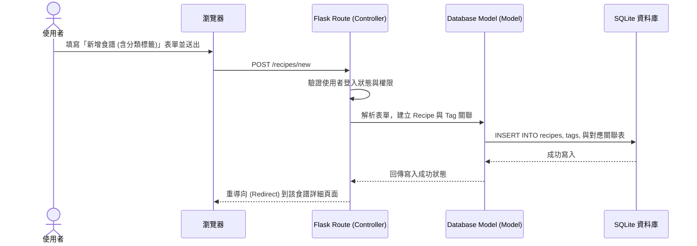

# 使用者流程與系統流程圖 (Flowchart) - 食譜收藏夾系統

以下文件視覺化了本系統的使用者操作路徑，以及主要功能在系統內資料流動的順序，以此作為後續 API 與頁面開發的依據。

## 1. 使用者流程圖 (User Flow)

這張圖展示了使用者進入網站後，可能進行的各種操作與頁面跳轉。

```mermaid
flowchart LR
    A([進入網站]) --> B{是否已登入？}
    B -->|未登入| C[進入登入/註冊頁面]
    C --> D[註冊或登入後回到首頁]
    B -->|已登入| E[進入首頁 / 個人食譜集]
    D --> E

    E --> F{選擇操作}
    F -->|探索推薦| G[瀏覽公用/懶人專用食譜]
    F -->|個人管理| H[手動新增/編輯食譜]
    F -->|搜尋篩選| I[依分類/標籤查找 (含外宿篩選)]

    H --> J[列入個人收藏/管理清單]
    G -->|點擊收藏| J
    I -->|找到食譜| J

    J --> K[食譜詳細頁面]
    K --> L{選擇進階操作}
    L -->|去買菜| M[加入購物清單 / 預算估算]
    L -->|開始下廚| N[開啟大字體互動式烹飪模式]
```

## 2. 系統序列圖 (Sequence Diagram)

這張圖以「新增食譜至收藏夾」為範例，描述了「從點擊按鈕」到「資料存入資料庫內」的完整流程。



## 3. 功能清單對照表

本表列出了每個功能、預計對應的 URL 路徑與 HTTP 方法，供後端路由實作參考。

| 功能區塊 | 具體行為 | HTTP 方法 | URL 路徑 |
| --- | --- | --- | --- |
| 帳號管理 | 註冊帳號 | GET / POST | `/auth/register` |
| 帳號管理 | 登入 | GET / POST | `/auth/login` |
| 帳號管理 | 登出 | GET | `/auth/logout` |
| 食譜管理 | 我的收藏夾 (首頁) | GET | `/` 或 `/recipes` |
| 食譜管理 | 探索公用/推薦食譜 | GET | `/recipes/explore` |
| 食譜管理 | 新增食譜 | GET / POST | `/recipes/new` |
| 食譜管理 | 瀏覽單一食譜 | GET | `/recipes/<id>` |
| 食譜管理 | 編輯單一食譜 | GET / POST | `/recipes/<id>/edit` |
| 食譜管理 | 刪除單一食譜 | POST | `/recipes/<id>/delete` |
| 互動與檢視 | 開啟互動式烹飪模式 | GET | `/recipes/<id>/cooking-mode` |
| 採買準備 | 查看/管理購物清單 | GET / POST | `/shopping-list` |
| 採買準備 | 將食譜食材加入清單 | POST | `/shopping-list/add/<recipe_id>` |
| 資源與預算 | 更新食材預算花費 | POST | `/shopping-list/budget` |
